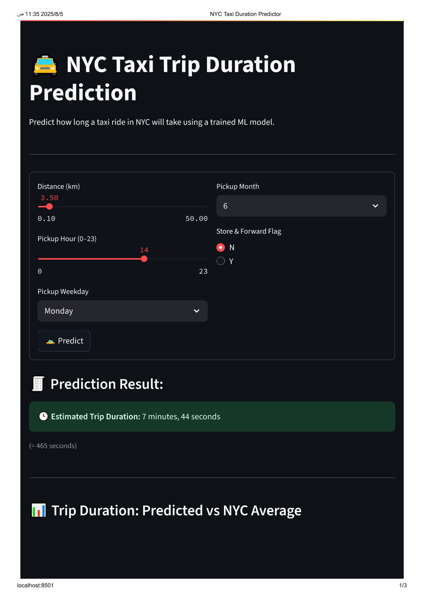
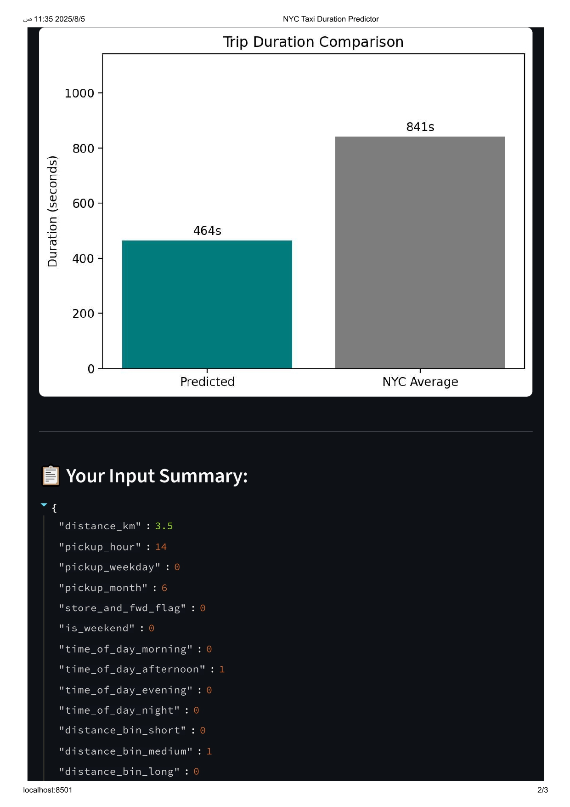

# 🚖 NYC Taxi Trip Duration Prediction

Predicting the duration of NYC taxi rides using Linear Regression, based on historical trip data. This project demonstrates an end-to-end machine learning pipeline from raw data to an interactive prediction app.

---

## 🎯 Project Goal

Build a full ML pipeline to:
- Clean and explore the dataset
- Engineer effective features
- Train and evaluate a regression model
- Deploy a real-time prediction app using Streamlit

---

## 📊 Dataset

- **Source**: NYC Taxi Trip data (`https://www.kaggle.com/competitions/nyc-taxi-trip-duration/data`)
- **Content**:  
  Includes:
  - Pickup and dropoff timestamps
  - Latitude and longitude coordinates
  - Passenger count
  - Vendor ID and flags
  - Target: `trip_duration` in seconds

---

## 🛠️ Steps Followed

### 1. 🧹 Data Cleaning
- Removed extreme outliers (unrealistic durations, distances)
- Filtered missing or invalid entries

### 2. 📈 Exploratory Data Analysis (EDA)
- Visualizations:
  - Histograms
  - Boxplots
  - Scatter plots
  - Correlation heatmap
- Added expert observations after each plot

### 3. 🧬 Feature Engineering
- Extracted time-based features: `pickup_hour`, `pickup_weekday`, `pickup_month`
- Calculated trip `distance_km` using Haversine formula
- One-hot encoded categorical variables
- Applied **cyclic encoding** to time-based features (e.g., hour, weekday)

### 4. 🤖 Model Training
- Used `LinearRegression` from scikit-learn
- Applied log transformation to target (`trip_duration`) to reduce skewness

### 5. 📊 Model Evaluation
- Metrics reported:
  - Mean Absolute Error (MAE)
  - Root Mean Squared Error (RMSE)
  - R² Score
- Included prediction error visualization

### 6. 💾 Model Saving
- Trained model saved as: `model.pkl`
- Feature list saved as: `features_used.pkl`

### 7. 🚀 Deployment with Streamlit
- Built an interactive web app (`streamlit_app.py`)
- Accepts user inputs for trip parameters
- Returns predicted trip duration (in minutes/seconds)
- Includes comparison plot between actual and predicted

---

## 🧠 Model

| Item              | Details                     |
|-------------------|-----------------------------|
| Algorithm         | Linear Regression           |
| Target Variable   | `log(trip_duration)`        |
| Engineered Features | Distance, Time, One-hot, Cyclic |
| Libraries Used    | scikit-learn, pandas, numpy, seaborn, matplotlib |

---

## 💻 Streamlit App

### ⚙️ How to Run Locally

1. 📦 Install dependencies:

```bash
pip install -r requirements.txt
```

2. ▶️ Run the Streamlit app:

```bash
streamlit run Streamlit_app.py
```

3. 🌐 Open your browser and access:
```
http://localhost:8501
```

---

## 🖥️ Streamlit App Preview

### 🔹 App Interface
Shows the input form and overall layout of the web app.



### 🔹 Output Example
Displays predicted duration vs. NYC average and user input breakdown.


---

## 📁 Project Files

| File Name                 | Description                                             |
|------------------------|----------------------------------------------|
| `trip_duration_prediction_reviewed_final.ipynb`  | Full pipeline: cleaning, EDA,modeling  |
| `Streamlit_app.py`   | Streamlit app for real-time predictions   |
| `model.pkl`               | Saved regression model                            |
| `features_used.pkl` | List of selected features used in the model  |
| `requirements.txt`   | Python dependencies                                      |

---

## 🚧 Future Improvements

- Try ensemble models (Random Forest, XGBoost) for better accuracy
- Incorporate external data (e.g., weather, traffic)
- Add map-based pickup/dropoff clustering (zone encoding)
- Deploy on cloud (Streamlit Cloud, Heroku, AWS, etc.)
- Add unit tests and CI/CD pipeline

---

## 🙋‍♂️ Author 
**Yousef Salah Nage**  
AI & Machine Learning Enthusiast  

## 🔗 Connect with Me
- [LinkedIn](https://www.linkedin.com/in/yousef-salah-nage-a3583636b)
- [GitHub](https://github.com/YousefSalah123)


---

## 📄 License

This project is licensed under the [MIT License](LICENSE).


---

## ⭐ Show Support

If you found this project helpful, feel free to:
- ⭐ Star the repo
- 🧠 Fork and experiment
- 📣 Share it with others
